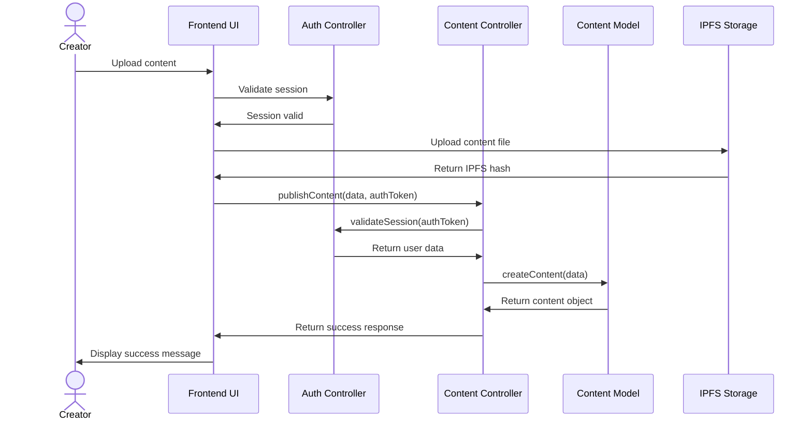
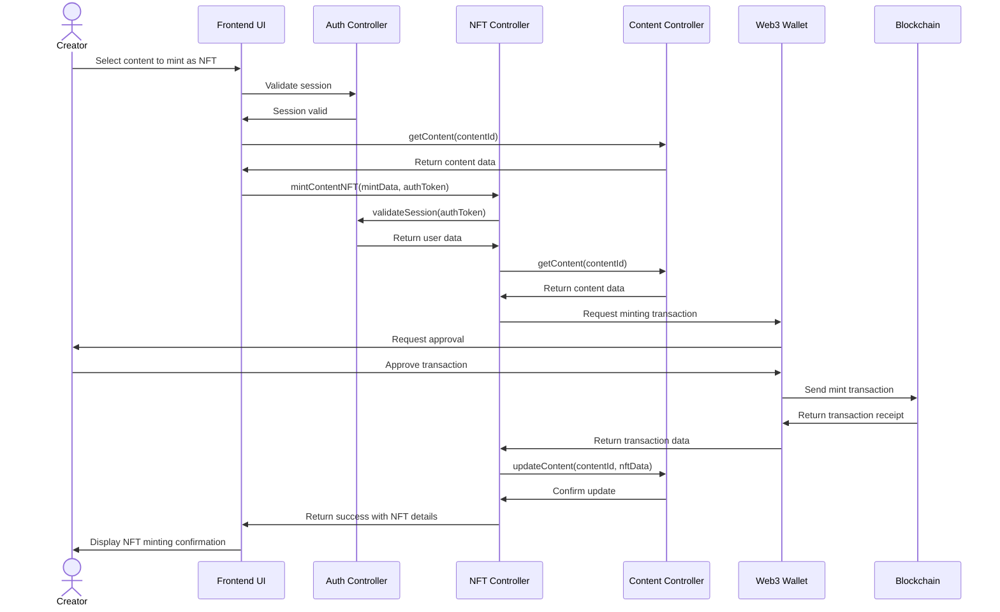
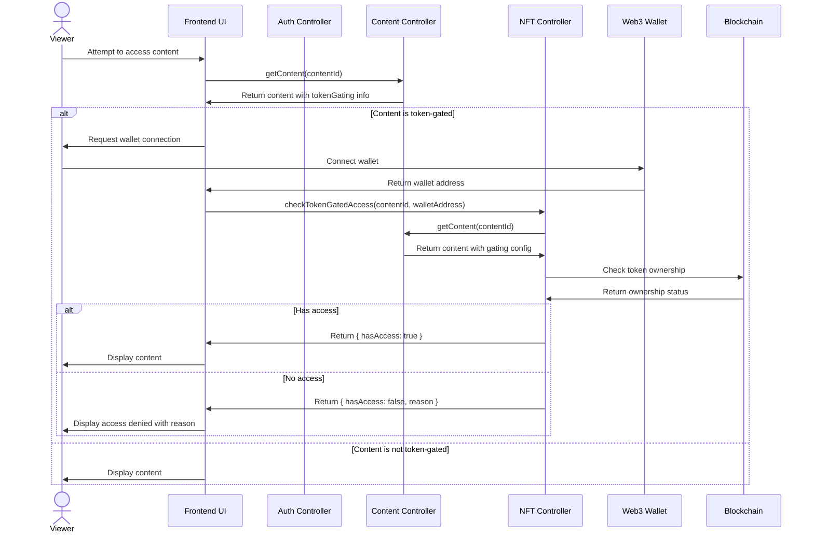
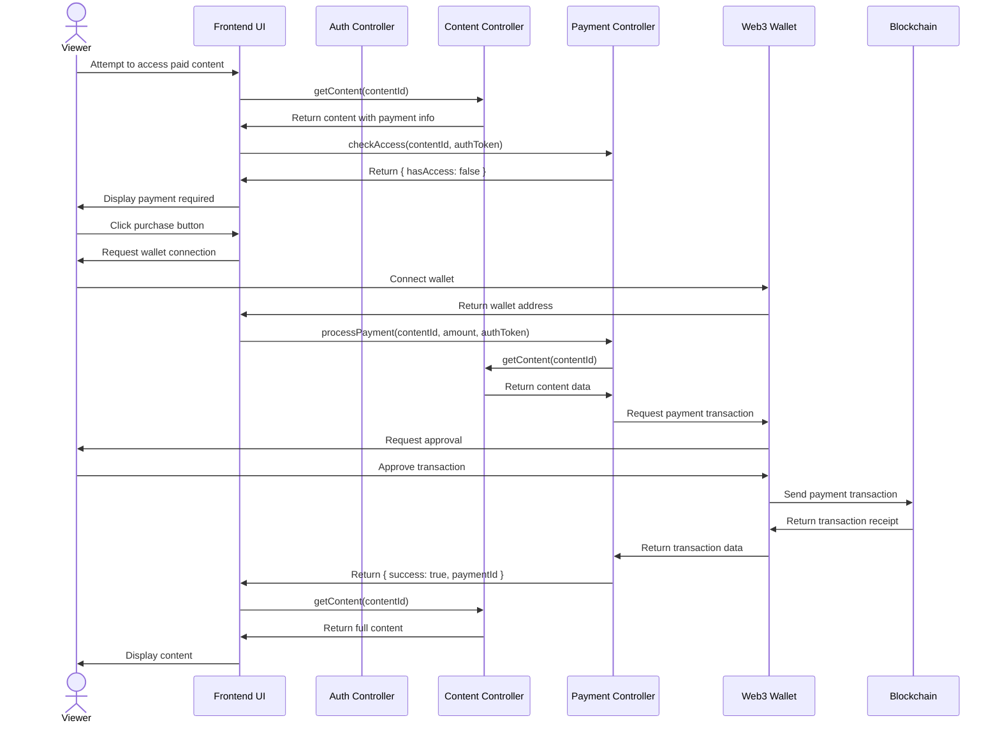

# Content Creation and NFT Minting Flow

This document provides a sequence diagram illustrating the process of content creation and NFT minting in our Web3 Streaming Platform.

## Content Creation Sequence

## NFT Minting Sequence

## Token Gated Access Sequence

## Payment and Content Access Sequence

These sequence diagrams illustrate the key user flows and system interactions for content management, NFT minting, token gating, and payment processing within our Web3 Streaming Platform.